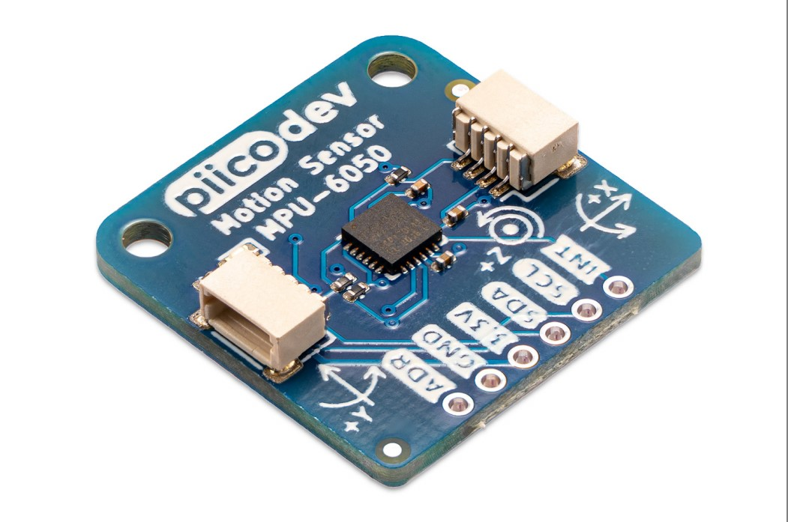

# PiicoDev® Motion Sensor MPU-6050

This is the repo for the Core Electronics [PiicoDev Motion Sensor MPU-6050](https://core-electronics.com.au/catalog/product/view/sku/CE07822).

Our PiicoDev® Motion Sensor makes it super easy to detect linear or angular motion in your next project. The Motion Sensor features a the ubiquitous MPU-6050 6-axis Inertial Measurement Unit (IMU) featuring 16-bit resolution Accelerometer and Gyroscope.

## Features

 - Measure linear motion, angular motion
 - Detect freefall or bumps/knocks
 - PiicoDev connector, compatible with Qwiic and STEMMA QT (3.3V only)
 - 2.54mm breakout for breadboarding/prototyping
 - Manufactured and [supported](https://core-electronics.com.au/contacts/) in Australia by Core Electronics

## Technical Specifications

 - Default I2C address: 0x68 (Pull ADR high, or solder the address jumper for 0x69)
 - Dimensions: 25.4x25.4mm
 - Mounting Holes: 2x M2.5
 - MPU6050:
   - Operating Voltage: 2.375 to 3.46V
   - Accelerometer Sensitivity: ±2 / ±4 / ±8 / ±16 g
   - Gyroscope Sensitivity: ±250 / ±500 / ±1000 / ±2000 °/s
   - Accelerometer Zero-G output (25°C, worst case): ±80mg
   - Gyroscope Zero-Rate output (25°C): ±20°/s

## License
This project is open source - please review the LICENSE.md file for further licensing information.

If you have any technical questions, or concerns about licensing, please contact technical support on the [Core Electronics forums](https://forum.core-electronics.com.au/).

*\"PiicoDev\" and the PiicoDev logo are trademarks of Core Electronics Pty Ltd.*
